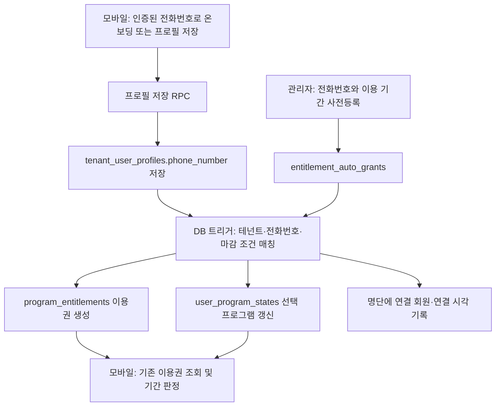

# XON 사전등록 기능 — 모바일 연동 확인 요청

작성일: 2026-09-11(KST)

## 전달 요약

관리자가 사전등록한 전화번호와 회원 프로필의 전화번호가 일치하면 **Supabase PostgreSQL 트리거가 기존 `program_entitlements`에 이용권을 자동 생성**합니다. 모바일에서 별도의 사전등록 신청 API를 호출할 필요는 없습니다.

다만 **현재 배포된 앱이 인증된 전화번호 저장, 이용권 조회, 이용 기간 판정, 화면 갱신을 올바르게 수행하는지 확인해야 앱 업데이트 필요 여부를 확정할 수 있습니다.** 특히 아래의 접근 판정 우회와 날짜 파싱 문제는 로컬 모바일 코드에서 발견한 확인 대상입니다.

모바일 담당자는 이 문서의 필수 확인 항목과 테스트를 검증하고 마지막 회신 양식을 작성해 주세요.

## 확인 범위

| 대상 | 확인 상태 |
| --- | --- |
| 관리자 웹 | `assist-on`의 사전등록 저장·중지 코드 확인 |
| Supabase | 연결된 `assist-on` 프로젝트의 트리거 활성화, 함수 정의, 프로필 저장 RPC 및 전화번호 정규화 결과를 읽기 전용으로 확인 |
| 모바일 소스 | `training-monorepo/apps/xon_app`, 확인 당시 커밋 `eec2fdc`, `pubspec.yaml` 버전 `1.4.7+42` |
| 실제 배포 앱 | iOS/Android 스토어 배포 버전 및 해당 소스와의 일치 여부 미확인 |
| 실제 가입·이용 | 테스트 계정으로 가입하거나 이용권을 생성하는 종단 간 테스트는 수행하지 않음 |

별도 구형 `xontraining` 저장소를 현재 배포 앱의 근거로 사용하지 않았습니다. 로컬 소스 버전만으로 스토어 동작을 보장할 수 없습니다.

## 서버 처리 흐름



별도 Edge Function 호출이나 시작일에 실행되는 예약 작업으로 부여하는 방식이 아닙니다. 프로필 저장과 연결된 DB 트리거가 처리합니다.

### 관리자 등록 조건

- 현재 관리자 기능은 날짜 고정형(`fixed_date`) 프로그램을 지원합니다. 기수형은 이 등록 흐름의 대상이 아닙니다.
- 이름과 전화번호를 입력하지만, 실제 매칭 키는 **같은 `tenant_id`와 정규화된 전화번호**입니다. 이름은 매칭 조건이 아닙니다.
- 한 번에 1~200명을 등록하며, 같은 테넌트·프로그램·전화번호의 중복 등록은 제한됩니다. 기존 명단과 중복되면 해당 일괄 등록 전체가 실패합니다.
- 명단 저장 자체는 기존 회원 프로필을 찾아 이용권을 일괄 부여하지 않습니다.

### 자동 부여 조건과 결과

트리거 `trg_tenant_user_profiles_apply_entitlement_auto_grants`는 `tenant_user_profiles`의 INSERT 또는 `phone_number` 열 UPDATE 뒤에 실행됩니다. 함수는 `apply_entitlement_auto_grants_for_profile()`입니다.

매칭 조건은 다음과 같습니다.

1. 테넌트와 전화번호가 일치함.
2. 명단의 `is_active = true`.
3. `expires_at`이 없거나 현재 시각 이상임.

조건이 맞으면 회원 멤버십을 보장하고, 동일 프로그램의 활성·미만료 이용권이 없을 때 이용권을 생성합니다. 명단의 `starts_at`, `ends_at`을 그대로 복사하고 `is_active = true`로 저장합니다. 주문·초대에서 생긴 이용권이 아니므로 `source_order_id`, `source_invitation_id`는 `null`입니다.

이미 활성·미만료 이용권이 있으면 순차적인 재저장 시 중복 생성하지 않으며, 기존 이용권의 기간도 덮어쓰지 않습니다. 이후 선택 프로그램과 명단의 `matched_user_id`, `matched_at`을 기록합니다.

**시작 전에도 이용권은 생성되고 선택 프로그램도 바뀔 수 있습니다.** 이용권 존재 또는 선택 프로그램 지정만으로 “지금 이용 가능”이라고 판단해서는 안 됩니다.

### 날짜 의미

| 필드 | 의미 | 관리자 입력의 저장 방식 |
| --- | --- | --- |
| `starts_at` | 이용 시작 시각 | 선택일 00:00:00 KST를 UTC 시각으로 저장 |
| `ends_at` | 이용 종료 시각 | 선택일 23:59:59 KST를 UTC 시각으로 저장 |
| `expires_at` | 전화번호 매칭으로 자동 부여받을 수 있는 마감 시각 | 선택일 23:59:59 KST를 UTC 시각으로 저장 |

예: 2026-10-01 시작 → `2026-09-30T15:00:00.000Z`. 2026-10-31 종료 → `2026-10-31T14:59:59.000Z`.

가입 마감과 이용 종료는 다른 개념입니다. 이미 생성된 이용권은 명단의 가입 마감이 지났다고 취소되지 않습니다. 관리자에서 사전등록을 “중지”해도 이미 생성된 이용권은 유지됩니다.

## 모바일에서 사용하는 기존 연결

현재 로컬 모바일 소스는 다음 RPC를 사용합니다.

| 상황 | RPC | 주요 입력 |
| --- | --- | --- |
| 온보딩 완료 | `complete_my_verified_onboarding` | `p_tenant_id`, `p_profile.phone_number` 및 필수 프로필·동의 값 |
| 프로필 수정 | `update_my_phone_verified_profile` | `p_tenant_id`, 프로필 값 |

라이브 RPC는 내부의 `private.save_my_xon_verified_profile`을 호출합니다. 내부 함수는 로그인 사용자, 지원 테넌트, 프로필 상태를 확인하고, **Auth에서 인증 완료된 전화번호와 제출 전화번호가 같은지 검증**합니다. 성공하면 국내 숫자 형식으로 `tenant_user_profiles.phone_number`를 UPDATE합니다.

이 함수는 같은 전화번호를 제출해도 UPDATE 문에 `phone_number`를 포함하므로 트리거가 실행되는 구조입니다. 단, 앱이 변경 없는 저장 요청 자체를 생략하거나 필수 입력을 보내지 않으면 이 경로에 도달하지 않습니다. 전화번호만 임의로 바꾸는 방식으로 인증 절차를 우회해서는 안 됩니다.

전화번호 정규화 함수는 `010-1234-5678`을 `01012345678`로 변환하는 것을 읽기 전용 쿼리로 확인했습니다. 단순 정규화 함수 자체는 `+82`를 국내 `0`으로 치환하지 않습니다. 현재 인증 프로필 RPC가 국내 형식으로 저장하므로, 앱이 해당 RPC를 사용하는지와 국가번호 입력 경로를 함께 확인해야 합니다.

모바일의 내 프로그램 조회는 기존 `program_entitlements`를 읽고, 선택 프로그램은 `user_program_states.active_program_id`를 읽습니다. 사전등록 명단을 모바일에서 직접 조회하거나 새 신청 화면을 만드는 것은 자동 부여에 필요한 작업이 아닙니다.

### 이미 가입한 회원을 나중에 사전등록한 경우

관리자가 명단을 추가한 뒤 **정상적인 프로필 저장 RPC가 다시 성공해야** 이 트리거로 매칭됩니다. 로그인, 앱 재실행, 목록 새로고침만으로 자동 부여된다고 가정하면 안 됩니다.

기존 회원도 명단 추가 즉시 부여해야 한다면, 관리자/서버에서 기존 프로필을 매칭하는 별도 처리가 필요합니다. 현재 구현된 동작은 아닙니다.

## 모바일팀 필수 확인 항목

### 1. 이용권 기간과 접근 판정 — 우선 확인

`home_data_source.dart`의 `hasProgramAccess()`는 활성 상태와 시작·종료 기간에 맞는 이용권을 조회하지만, 이용권이 없어도 `user_program_states.active_program_id`가 일치하면 `true`를 반환합니다.

사전등록 트리거가 시작 전에도 선택 프로그램을 설정하므로, **시작 전 또는 만료 후에 클라이언트 접근 플래그가 참이 될 수 있습니다.** 선택 상태와 이용 권한을 분리하고, 기존에 이 fallback이 필요한 경로가 있는지 검토해 주세요.

- 시작 전·종료 후 홈/상세 화면의 버튼과 안내가 올바른지 확인.
- 실제 운동 콘텐츠 조회 RPC/RLS에서도 기간을 검사하는지 확인.
- 이 소스 분석만으로 서버 콘텐츠가 실제로 노출된다고 확정한 것은 아닙니다. 화면 판정과 서버 권한을 각각 검증해야 합니다.

### 2. 이용권 시각 파싱 — 우선 확인

`my_program_repository.dart`는 이용권의 `starts_at`, `ends_at`에도 `_asDate()`를 사용합니다. 이 함수는 파싱 결과를 `DateTime(year, month, day)`로 다시 만들어 **시각과 원래 시간대 정보를 제거**합니다.

따라서 UTC로 전달된 KST 시작·종료 시각을 다른 시점으로 해석할 수 있습니다. 이용권 판정에서는 원래 timestamp를 보존해 동일한 UTC 기준으로 비교하고, 날짜만 필요한 프로그램 일정 표시와 구분해 주세요. KST 자정 시작과 종료일 밤을 반드시 테스트해야 합니다.

### 3. 배포 앱의 전화번호 저장 경로

- iOS/Android 배포 버전과 소스 커밋을 확인.
- 신규 가입 시 인증된 전화번호를 위 온보딩 RPC로 전달하는지 확인.
- 기존 회원이 같은 번호로 프로필 저장했을 때 요청이 전송되고 성공하는지 확인.
- 프로필 수정 RPC가 요구하는 표시 이름·성별·전화번호 등 필수 값이 빠지지 않는지 확인.
- 국내 번호·하이픈·국가번호 입력이 동일한 인증 전화번호로 처리되는지 확인.

### 4. 화면 갱신과 상태 표시

- 온보딩/프로필 저장 완료 뒤 내 프로그램, 홈의 접근 상태, 선택 프로그램 캐시를 갱신하는지 확인.
- 앱을 재시작하지 않아도 새 이용권이 표시되는지 확인.
- 시작 전 이용권을 “만료”로 오해하게 표시하지 않는지 확인. 현재 내 프로그램 분류는 미래 시작 이용권도 현재 유효하지 않은 목록으로 분류할 수 있습니다.
- 결제 주문이 없는 관리자 부여 이용권도 정상 표시되는지 확인.

## 테스트 시나리오

테스트 환경과 인증 가능한 테스트 계정을 사용하세요. 각 테스트에서 DB 결과와 화면 결과를 별도로 기록하세요.

| 번호 | 시나리오 | 기대 결과 |
| --- | --- | --- |
| T1 | 명단 등록 후 같은 인증 번호로 신규 온보딩 완료 | 이용권 생성, 명단 연결 시각 기록, 프로그램 화면 반영 |
| T2 | 전화번호가 다른 회원으로 온보딩 | 해당 명단의 이용권이 생성되지 않음 |
| T3 | 다른 테넌트 회원/요청으로 접근 | 다른 테넌트 명단으로 부여되지 않음; 지원하지 않는 RPC 요청은 거부 |
| T4 | 이미 가입한 회원을 명단에 추가하고 앱만 재실행 | 프로필 쓰기 없이는 이 트리거에 의한 신규 부여 없음 |
| T5 | T4 회원이 같은 인증 번호로 정상 프로필 저장 | 이용권 생성, 재시작 없이 화면 갱신 |
| T6 | T5 저장을 순차적으로 반복 | 기존 활성·미만료 이용권이 중복 생성되거나 기간이 변경되지 않음 |
| T7 | 가입 마감 전과 후에 각각 프로필 저장 | 마감 전에는 부여, 마감 후에는 신규 부여되지 않음 |
| T8 | 시작일 전 매칭 후 홈/상세/콘텐츠 조회 | 이용권은 존재하되 시작 전 이용은 차단 |
| T9 | KST 시작일 00:00:00 전후 | 정확한 시작 시각부터 이용 가능; UTC 날짜 차이로 조기 개방되지 않음 |
| T10 | KST 종료일 낮·23:59:59·그 이후 | 낮에는 조기 만료되지 않으며 저장된 종료 시각 이후에는 이용 차단 |
| T11 | 이미 매칭된 명단의 가입 마감 경과 또는 명단 중지 | 기존 이용권은 원래 이용 기간까지 유지 |
| T12 | 미매칭 명단을 중지한 뒤 프로필 저장 | 신규 이용권이 생성되지 않음 |
| T13 | 하이픈/국가번호 형태로 같은 인증 번호 제출 | 검증된 RPC를 거쳐 국내 숫자 형식으로 저장되고 올바르게 매칭 |
| T14 | 한 회원에게 여러 프로그램 명단이 동시에 매칭 | 각 이용권과 선택 프로그램 UX 확인; 서버 반복문에 순서 보장이 없어 마지막 선택 프로그램을 특정 값으로 가정하지 않음 |

추가 서버 정책 확인: 매칭 조건에 `matched_user_id is null`이 없으므로, 연결 완료 표시는 엄격한 1회 사용 잠금이 아닙니다. 동일 인증 번호의 계정 재생성 등에서 재부여를 허용할지는 서버 정책으로 별도 판단해야 합니다.

### 테스트별 확인할 DB 값

| 테이블 | 확인할 값 |
| --- | --- |
| `tenant_user_profiles` | 테스트 회원의 테넌트, 전화번호 저장 형식 |
| `entitlement_auto_grants` | 해당 명단의 `is_active`, `expires_at`, `matched_user_id`, `matched_at` |
| `program_entitlements` | 같은 테넌트·회원·프로그램의 행 수, `is_active`, 원본 `starts_at`, `ends_at` |
| `user_program_states` | 해당 회원의 `active_program_id` |

DB 확인은 권한 있는 관리자 도구에서 수행하세요. 모바일에 관리자 키나 명단 조회 권한을 추가할 필요는 없습니다. 테스트 결과를 공유할 때는 실제 회원 개인정보를 제외해 주세요.

## 업데이트 필요 여부 판단 및 회신

**업데이트 없이 가능:** 실제 배포 앱에서 인증 프로필 저장 → 자동 부여 → 이용권 조회 → 정확한 기간 판정 → 화면 갱신이 모두 검증되는 경우.

**모바일 수정·배포 필요:** 배포 앱에 전화번호 저장 경로가 없거나, 접근 판정·시각 파싱·화면 갱신 문제가 재현되고 앱 수정이 필요한 경우.

**서버 작업 검토:** 기존 회원의 명단 등록 즉시 부여, 연결의 1회 사용 제한 등 현재 서버 동작과 다른 정책이 필요한 경우.

아래 형식으로 회신해 주세요.

```text
검증한 iOS 버전/빌드/커밋:
검증한 Android 버전/빌드/커밋:
테스트 환경:
신규 가입 자동 부여: 통과 / 실패 (근거)
기존 회원 동일 번호 재저장: 통과 / 실패 (근거)
시작 전·종료 후 화면 및 서버 접근: 통과 / 실패 (근거)
KST/UTC 시작·종료 경계: 통과 / 실패 (근거)
저장 후 화면 갱신: 통과 / 실패 (근거)
실행한 테스트 번호 및 미실행 항목:
모바일 업데이트 필요 여부와 수정 범위:
서버 확인/수정 요청:
```

## 근거 코드 위치

아래 경로는 각 저장소 루트 기준입니다. 라이브 RPC 정의는 작성일에 별도 읽기 전용 조회로 확인했습니다.

관리자 웹 `assist-on`:

- `src/lib/admin/actions.ts`: `registerProgramRosterAction`, `stopProgramPreregistrationAction`
- `src/lib/admin/preregistration.ts`: 전화번호·명단 파싱
- `src/lib/program/cohorts.ts`: KST 시작·종료 시각 변환
- `src/components/admin/program-preregistrations-manager.tsx`: 등록 UI와 사용자 안내
- `supabase/migrations/20260812120000_create_entitlement_auto_grants.sql`: 명단 테이블, 트리거
- `supabase/migrations/20260812121000_expire_entitlement_auto_grants.sql`: 마감 조건을 포함한 자동 부여 함수

모바일 `training-monorepo/apps/xon_app`:

- `lib/src/feature/auth/data/datasource/auth_data_source.dart`: 온보딩/프로필 저장 RPC
- `lib/src/feature/profile/data/datasource/my_program_data_source.dart`: 이용권·선택 프로그램 조회
- `lib/src/feature/profile/data/repository/my_program_repository.dart`: `_asDate`, `_isCurrentlyValid`
- `lib/src/feature/home/data/datasource/home_data_source.dart`: `hasProgramAccess`
- `lib/src/feature/auth/presentation/provider/onboarding_provider.dart`: 온보딩 완료 후 상태 갱신
- `lib/src/feature/profile/presentation/provider/profile_provider.dart`: 프로필 저장 후 상태 갱신
- `lib/src/feature/profile/presentation/provider/my_program_provider.dart`: 내 프로그램 갱신

이 문서는 연동 확인용이며, 작성 과정에서 앱 코드·DB 스키마·회원 데이터는 변경하지 않았습니다.
