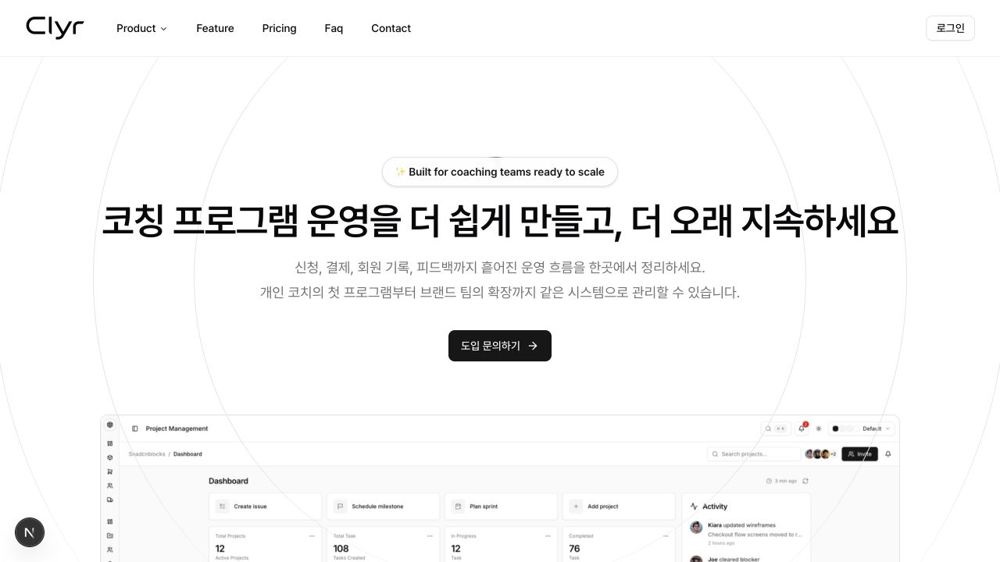
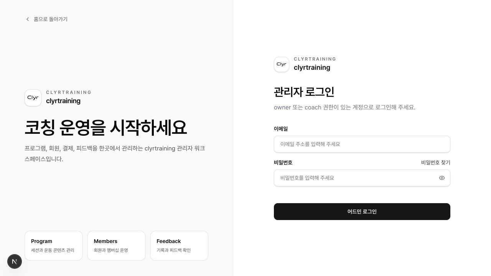
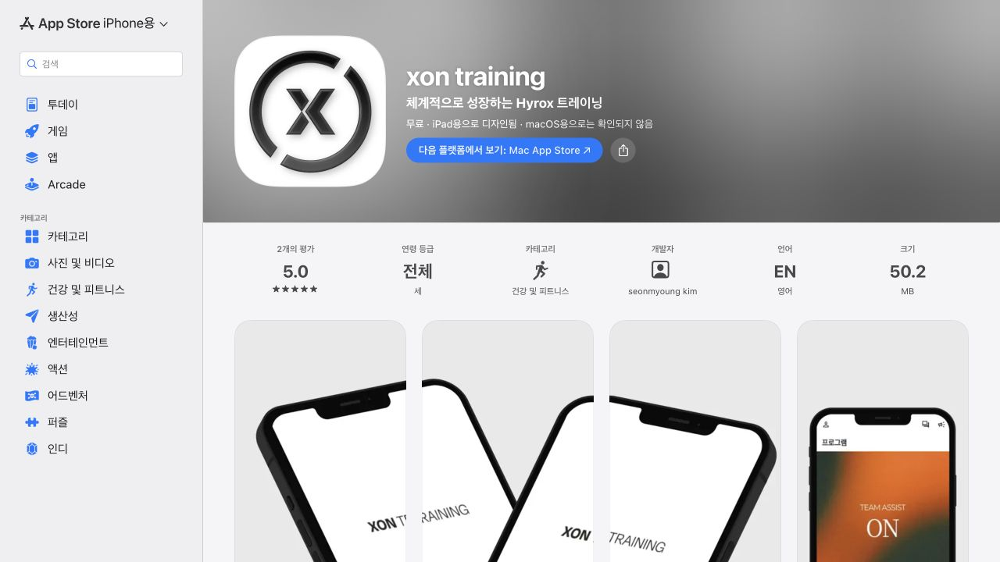

# CLYR 제품·수익화 점검

점검일: 2026-09-06

## 결론

CLYR는 일반 운동 기록 앱보다 **코치·부티크 센터를 위한 멀티테넌트 운영 플랫폼 + 화이트라벨 회원 앱**에 가깝다. 프로그램, 멤버십, 결제·구독, 피드백, 기록, 콘텐츠, 커뮤니티, 예약, 지점과 코치 관리가 이미 한 제품 안에 연결되어 있다. 가장 빠른 수익화는 새 소비자 기능을 늘리는 것이 아니라, 현재 기능을 패키지화해 도입비·월 구독료·거래 수수료·부가 기능으로 판매하는 것이다.

## 확인한 사용자 흐름

### 1. 제품 소개와 가격 확인 — 보통

- 장점: 코칭 운영을 한곳에 모은다는 문제 정의가 분명하고, 실제 파트너 로고와 가격이 있다.
- 위험: 히어로의 제품 화면이 실제 CLYR가 아닌 일반 프로젝트 관리 화면처럼 보여 제품 신뢰를 깎는다.
- 위험: 각 가격 카드에 시작/상담 버튼이 없고 최종 전환은 이메일 또는 인스타그램으로 끊긴다.
- 위험: Starter, Growth, Partner, Enterprise의 차이가 기능 수와 회원 수 중심이라 구매자가 기대하는 매출 증가·시간 절감 가치가 약하다.
- 접근성 관찰: 큰 제목과 주요 버튼은 읽기 쉽다. 다만 연한 회색 설명문은 실제 명암비 측정이 필요하다.

### 2. 관리자 로그인 — 좋음

- 장점: 프로그램·회원·피드백이라는 핵심 업무가 로그인 전에 바로 설명되고, 역할 조건도 명확하다.
- 위험: 잠재 고객이 제품을 경험할 수 있는 데모 계정이나 둘러보기 경로가 없다.
- 위험: 로그인 이후의 강력한 운영 기능이 비회원에게 거의 보이지 않아 가격을 납득시키기 어렵다.
- 접근성 관찰: 입력 레이블과 비밀번호 찾기 경로가 명시되어 있다. 키보드 포커스 순서와 오류 안내는 실제 로그인 테스트가 필요하다.

### 3. 배포된 브랜드 앱 확인 — 보통

- 장점: XON Training과 Amor Lab처럼 별도 브랜드 앱을 실제 출시한 이력이 있어 화이트라벨 상품의 강한 증거가 된다.
- 위험: XON 앱은 평가 수가 2개로 초기 신뢰 신호가 아직 작다.
- 위험: App Store에 등록된 지원 언어가 영어로 표시되며, 손쉬운 사용 지원 정보도 등록되지 않았다.
- 기회: 두 앱의 도입 전/후 운영시간, 회원 참여율, 재구매율을 사례 연구로 만들면 영업 자산이 된다.

## 우선순위가 높은 수익 모델

1. **도입비 + 월 플랫폼 요금**: 데이터 이전, 브랜드 설정, 앱 심사와 교육을 유료 온보딩으로 분리한다.
2. **화이트라벨 앱 상위 플랜**: 별도 앱스토어 등록, 앱 아이콘·브랜드, 업데이트 운영, 전담 지원을 묶는다.
3. **활성 회원 초과 요금**: 10명/50명 경계에서 갑자기 큰 플랜으로 뛰기보다 기본 구간 + 초과 회원당 요금으로 전환한다.
4. **거래 기반 수익**: 프로그램·구독·클래스 판매액에 플랫폼 수수료를 붙이거나 월 요금에 따라 수수료를 낮춘다. PG 수수료와 플랫폼 수수료는 분리해 표시한다.
5. **매출형 부가 기능**: 자동 리마인드, 미결제·이탈 위험 알림, 재등록 캠페인, 리드 관리, 고급 리포트를 유료 애드온으로 판다.
6. **프로그램 마켓플레이스**: 충분한 코치 공급과 고객 유입이 생긴 뒤 신규 회원 연결에 소개 수수료를 받는다.

## 권장 가격 실험

- Starter: 무료, 활성 회원 3명, 프로그램 1개
- Growth: 월 9.9만원, 활성 회원 10명
- Studio: 월 29.9만~39.9만원, 활성 회원 50명, 다중 코치·결제·자동화
- White-label: 월 49.9만~79.9만원 + 초기 구축비 200만~500만원
- Enterprise: 다지점·본사 관리·SLA·데이터 연동 별도 견적
- 초과 회원: 1명당 월 5천~1만원 범위 A/B 테스트
- 거래 수수료: 1~2% 범위 실험, 상위 플랜은 인하 또는 면제

가격은 확정안이 아니라 3~5개 잠재 고객 인터뷰와 실제 견적으로 검증할 실험 범위다.

## 90일 실행 순서

### 0~2주: 판매 전환 개선

- 가격 카드마다 `무료로 시작`, `데모 예약`, `견적 받기`를 연결한다.
- 이메일 대신 짧은 리드 폼과 상담 일정 예약을 둔다.
- 실제 관리자 대시보드와 회원 앱 화면으로 히어로 이미지를 교체한다.
- XON·Amor Lab의 도입 전후 숫자를 받아 사례 연구 2개를 만든다.

### 3~6주: SaaS 과금 기반

- 테넌트별 플랜, 활성 회원 수, 기능 권한, 초과 사용량을 기록한다.
- CLYR 자체 월 구독 결제, 청구 내역, 플랜 변경, 사용량 알림을 만든다.
- 새 센터가 스스로 브랜드·코치·첫 프로그램을 설정하는 온보딩 체크리스트를 만든다.

### 7~12주: 고객 매출을 올리는 자동화

- 결제 실패, 프로그램 만료, 장기 미접속, 미응답 피드백 알림을 자동화한다.
- 쿠폰·추천 코드별 매출과 재등록률을 보여준다.
- 센터가 클릭 몇 번으로 기존 프로그램을 복제하고 다음 기수를 판매하게 만든다.

## 지금 보류할 것

- 범용 소비자 피트니스 앱으로의 확장
- 커뮤니티 기능의 대규모 고도화
- 별도 수익 가설 없는 AI 기능
- 여러 운동 종목을 동시에 공략하는 마케팅

먼저 하이록스·기능성 트레이닝 센터에서 반복 가능한 영업과 도입 구조를 만든 뒤 인접 종목으로 넓히는 편이 안전하다.

## 증거 한계

- 관리자 내부는 인증 계정 없이 코드와 로그인 전 화면까지만 확인했다.
- 실제 결제 성공/실패, 회원 앱의 전체 사용 흐름, 모바일 키보드 탐색과 스크린리더 동작은 이번 점검 범위에 포함하지 않았다.
- 가격은 실제 고객 인터뷰, 이탈률, 지원 비용, 앱 유지보수 비용 데이터로 재검증해야 한다.
